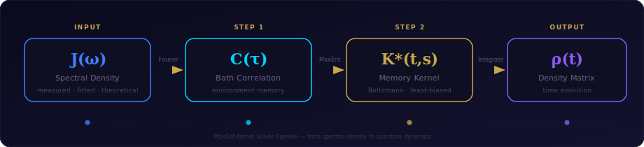
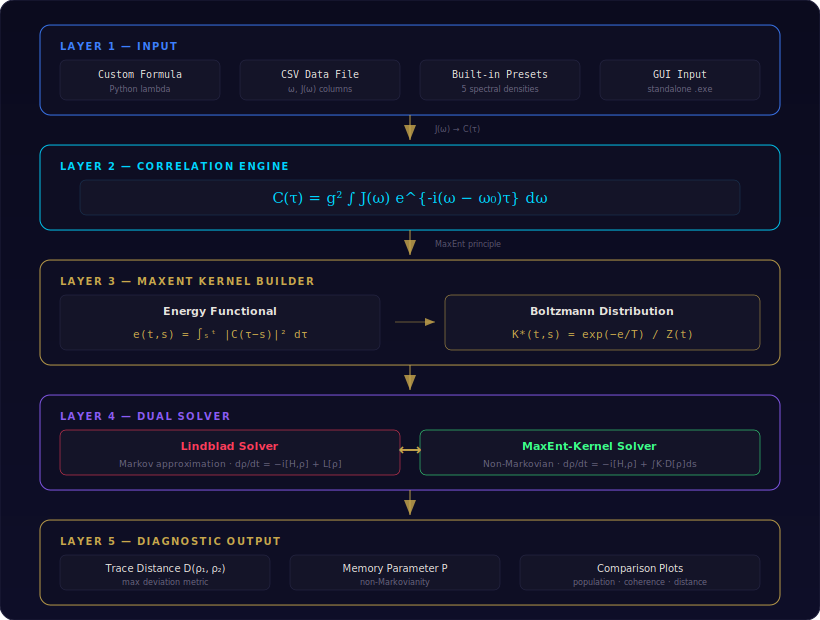
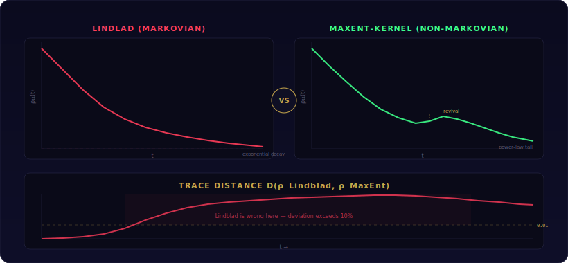
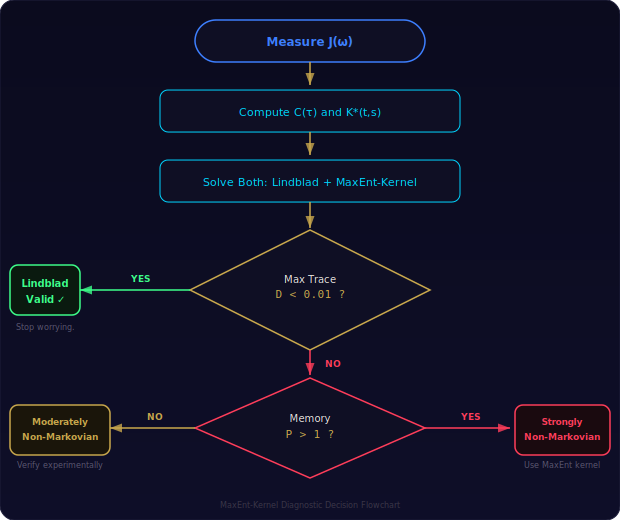

<!-- ╔══════════════════════════════════════════════════════════════╗
     ║   MaxEnt-Kernel — Non-Markovian Quantum Dynamics Solver    ║
     ║   Boltzmann Memory Kernel via Maximum Entropy Principle    ║
     ║   DESVAUX G.J.Y. (2008–2026) · Hope 'n Mind Research     ║
     ╚══════════════════════════════════════════════════════════════╝ -->

<div align="center">

<!-- Badges -->
[](https://doi.org/10.5281/zenodo.19486927)
[](./LICENSE)
[](https://orcid.org/0009-0008-9813-4627)
[]()

<br/>



<br/><br/>

# ⚛️ MaxEnt-Kernel

**Non-Markovian Quantum Dynamics Solver with Boltzmann Memory Kernel**

*A diagnostic tool that detects where Lindblad fails — and shows you what non-Markovian dynamics actually look like for your specific environment.*

<br/>

</div>

---

## Table of Contents

- [Why This Solver Exists](#-why-this-solver-exists)
- [Theory in 3 Equations](#-theory-in-3-equations)
- [Architecture](#-architecture)
- [Bring Your Own Data](#-bring-your-own-data)
- [Built-in Spectral Densities](#-built-in-spectral-densities)
- [What the Results Tell You](#-what-the-results-tell-you)
- [Python API](#-use-your-own-jω-in-python)
- [Known Limitations](#-known-limitations)
- [Reference](#-reference)
- [License](#-license)

---

## 🔬 Why This Solver Exists

Every quantum photonics lab measures the spectral density **J(ω)** of their environment — a cavity, a photonic crystal, a waveguide. Then, to predict how their qubit decoheres, they plug it into the **Lindblad master equation**. It's the default. Everybody does it.

The problem is that **Lindblad assumes the environment forgets instantly**. No memory. And everybody knows this is wrong as soon as the spectral density has structure — a sharp peak, a band edge, discrete modes. In those cases, the environment remembers, and Lindblad gives the wrong answer. Coherence decays too fast. Population revivals vanish. The prediction diverges from reality.

The reason people keep using Lindblad anyway is that the alternatives are painful. Full non-Markovian methods (Nakajima-Zwanzig, HEOM, process tensor) are either system-specific, computationally heavy, or require expertise that most experimentalists don't have time for.

> **This solver is the missing middle ground.** You give it your J(ω) — measured, fitted, or theoretical — and it:
>
> 1. Computes the bath correlation function **C(τ)** from your spectral density
> 2. Builds a memory kernel **K*(t,s)** using the Maximum Entropy (Jaynes MaxEnt) principle — the least-biased kernel consistent with your environment's correlations
> 3. Solves the full integro-differential master equation with that kernel
> 4. Solves the standard Lindblad equation in parallel
> 5. **Tells you exactly how much they disagree, where, and why**

If the trace distance between the two solutions stays below **1%**, Lindblad is fine for your system — you can stop worrying. If it's at **10%** or more, your Lindblad predictions are wrong and the solver shows you what non-Markovian dynamics actually look like: population revivals, slower coherence decay, power-law tails instead of exponentials.

**It's a diagnostic tool.** Not a replacement for full theory, but a detector that says *"here, Lindblad lies"* — and shows you what the truth looks like.

---

## 🏗️ Architecture

<div align="center">

</div>

### Standalone Executable (no Python needed)

Download `Installer/MAXENT-Kernel.exe` and double-click. Everything is bundled.

---

## 📊 Bring Your Own Data

### Custom Formula

Type any Python expression using `w` as the frequency variable:

```python
0.05**1.5 / np.sqrt(w - 5) if w > 5 else 0
```

### CSV File

2 columns (`omega`, `J`), header row, comma/tab/space separated:

```csv
omega,J
0.1,0.003
1.0,0.089
5.0,0.034
```

The solver interpolates linearly between your data points.

---

## 🌊 Built-in Spectral Densities

| Function | Formula | Use Case |
|:---|:---|:---|
| `SpectralDensities.ohmic(eta, wc, s)` | η ωˢ e^{-ω/ωc} | Generic thermal bath |
| `SpectralDensities.lorentzian(gamma, wc, width)` | Lorentzian peak | Single-mode cavity |
| `SpectralDensities.band_edge(beta, we)` | β^{3/2} / √(ω−ωe) | Photonic crystal edge |
| `SpectralDensities.photonic_crystal(beta, we, gap)` | Band edge + gap | PhC with band gap |
| `SpectralDensities.waveguide(gamma_1d, tau_rt, r)` | Periodic peaks | Waveguide QED with mirror |

---

## 📈 What the Results Tell You

<div align="center">

</div>

<div align="center">

</div>

| Metric | Value | Interpretation |
|:---|:---|:---|
| Max trace distance | **< 0.01** | ✅ Lindblad is fine for your system. Stop worrying. |
| Max trace distance | **> 0.01** | ❌ Lindblad is wrong. Solver shows by how much and where. |
| Memory parameter **P** | **< 0.1** | Markovian regime |
| Memory parameter **P** | **> 1** | Strongly non-Markovian |
| Memory kernel shape | Exponential | Memory from cavity coupling |
| Memory kernel shape | Power-law tail | Memory from band edge |
| Memory kernel shape | Oscillatory revivals | Memory from waveguide modes |

---

## 🐍 Use Your Own J(ω) in Python

```python
import numpy as np
from Program.core import MemoryKernel
from Program.core.lindblad import LindbladSolver

# YOUR measured spectral density
J = lambda w: 0.1 * w**3 * np.exp(-w / 10)

# Build memory kernel
K = MemoryKernel.from_spectral_density(J, g=0.1, T=0.05, omega0=5.0)

# Solve non-Markovian dynamics
rho0 = np.array([0, 0, 1])  # excited state
nm = K.solve(rho0, np.linspace(0, 50, 200))

# Compare with Lindblad
L = LindbladSolver.from_spectral_density(J, g=0.1, omega0=5.0)
m = L.solve(rho0, np.linspace(0, 50, 200))

print(f"Max deviation: {np.max(nm.trace_distance_from(m)):.4f}")
print(f"Non-Markovianity P = {K.non_markovianity():.4f}")
```

---

## ⚠️ Known Limitations

### 1. Weak-Coupling Regime Only

The energy functional `e(t,s)` is computed using a mean-field factorization `ρ_SE ≈ ρ_S ⊗ ρ_E`, valid at order `g ≪ ω₀`. At strong coupling (`g > 1`), the factorization breaks and the solver's predictions become unreliable. **This is a stated domain of validity, not a bug.**

### 2. MaxEnt Kernel Is True by Construction

The kernel `K*(t,s)` is the least-biased distribution consistent with the bath correlations. You cannot falsify MaxEnt itself. What you **CAN** falsify is whether nature's memory kernel matches the MaxEnt prediction for a specific J(ω). If your measured decay curve disagrees with the solver's output, the MaxEnt kernel is wrong for that environment — and **that's a publishable result.**

### 3. No Experimental Data Included

This solver is a theoretical diagnostic tool. It predicts what non-Markovian dynamics should look like given J(ω). Comparing its predictions with actual lab measurements is the researcher's job.

---

## 📖 Reference

<div align="center">

**DESVAUX G.J.Y.** (2008–2026). *MaxEnt-Kernel: Non-Markovian Quantum Dynamics Solver with Boltzmann Memory Kernel.*

[](https://doi.org/10.5281/zenodo.19486927)
[](https://orcid.org/0009-0008-9813-4627)

</div>

---

## 📜 License

**Proprietary** — Copyright © 2008–2026 Hope 'n Mind Research. All rights reserved.

**Scientific Free License** — Copyright © 2024–2026 Hope 'n Mind Research. All rights reserved.

A free scientific license is granted without any reservation or prior request for **academic and non-profit research**, provided the work is properly cited.

📧 Contact: [contact@hopenmind.com](mailto:contact@hopenmind.com)

See [LICENSE](./LICENSE) for full terms.

---

<div align="center">

*Built with the Maximum Entropy principle — because nature's memory deserves the least-biased representation.*

</div>
