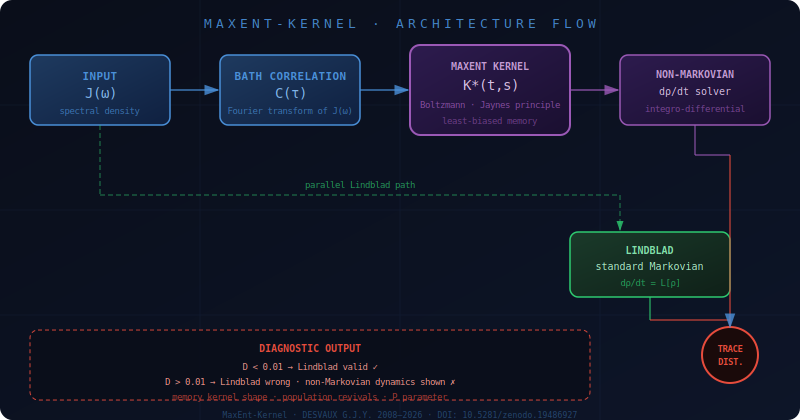
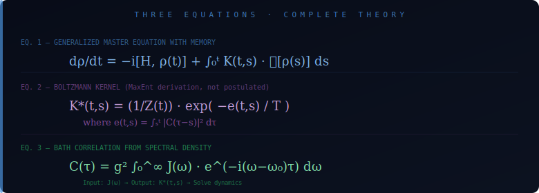
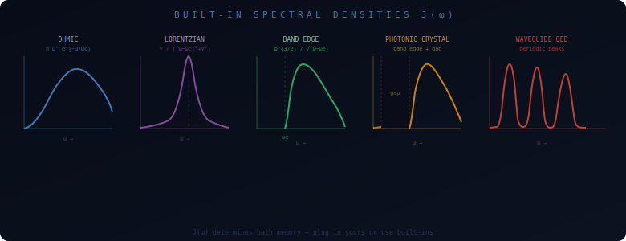
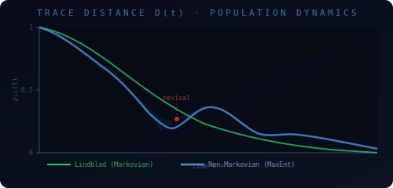
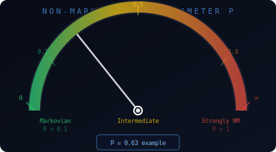
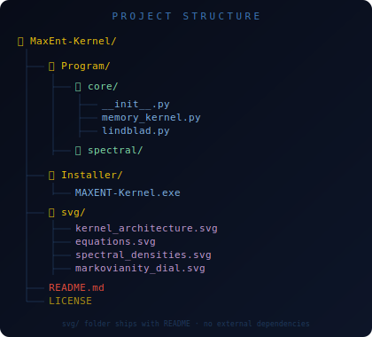

<!-- MaxEnt-Kernel README ── DESVAUX G.J.Y. 2008-2026 ─────────────────────────
     DOI: 10.5281/zenodo.19486927
     ORCID: 0009-0008-9813-4627
     All SVG diagrams live in the svg/ folder alongside this file.
─────────────────────────────────────────────────────────────────────────── -->

<div align="center">

```
╔══════════════════════════════════════════════════════╗
║  M A X E N T - K E R N E L                          ║
║  Non-Markovian Quantum Dynamics Solver               ║
║  with Boltzmann Memory Kernel                        ║
╚══════════════════════════════════════════════════════╝
```

[](https://doi.org/10.5281/zenodo.19486927)
[](https://orcid.org/0009-0008-9813-4627)
[](#license)

*The missing middle ground between Lindblad and full non-Markovian methods.*

</div>

---

## Why This Solver Exists

Every quantum photonics lab measures the spectral density **J(ω)** of their
environment — a cavity, a photonic crystal, a waveguide. Then, to predict how
their qubit decoheres, they plug it into the **Lindblad master equation**.
It's the default. Everybody does it.

> **The problem:** Lindblad assumes the environment forgets instantly. No memory.
> And everybody knows this is wrong as soon as the spectral density has
> structure — a sharp peak, a band edge, discrete modes.

In those cases, the environment *remembers*, and Lindblad gives the wrong answer.
Coherence decays too fast. Population revivals vanish. The prediction diverges
from reality.

The reason people keep using Lindblad anyway is that the alternatives are painful.
Full non-Markovian methods (Nakajima–Zwanzig, HEOM, process tensor) are either
system-specific, computationally heavy, or require expertise that most
experimentalists don't have time for.

**This solver is the missing middle ground.** You give it your J(ω) and it:

1. Computes the bath correlation function **C(τ)** from your spectral density
2. Builds a memory kernel **K\*(t,s)** using the Maximum Entropy (Jaynes MaxEnt)
   principle — the least-biased kernel consistent with your environment's correlations
3. Solves the full integro-differential master equation with that kernel
4. Solves the standard Lindblad equation in parallel
5. Tells you exactly how much they disagree, where, and why

---

## Architecture Flow



---

## Theory in 3 Equations



**Equation 1** — Generalized master equation with memory:

```
dρ/dt = −i[H, ρ(t)] + ∫₀ᵗ K(t,s) · D[ρ(s)] ds
```

**Equation 2** — Boltzmann kernel *(derived from MaxEnt, not postulated)*:

```
K*(t,s) = (1/Z(t)) · exp(−e(t,s) / T)
where  e(t,s) = ∫ₛᵗ |C(τ−s)|² dτ
```

**Equation 3** — Bath correlation from spectral density:

```
C(τ) = g² ∫₀^∞ J(ω) · e^(−i(ω−ω₀)τ) dω
```

> That's it. Input **J(ω)**, get **K\*(t,s)**, solve dynamics.

---

## Built-in Spectral Densities



| Name | Formula | Use case |
|------|---------|----------|
| `SpectralDensities.ohmic(eta, wc, s)` | η ωˢ e^{−ω/ωc} | Generic thermal bath |
| `SpectralDensities.lorentzian(gamma, wc, width)` | Lorentzian peak | Single-mode cavity |
| `SpectralDensities.band_edge(beta, we)` | β^{3/2} / √(ω−ωe) | Photonic crystal edge |
| `SpectralDensities.photonic_crystal(beta, we, gap)` | Band edge + gap | PhC with band gap |
| `SpectralDensities.waveguide(gamma_1d, tau_rt, r)` | Periodic peaks | Waveguide QED with mirror |

---

## Diagnostic Output



| Result | Meaning |
|--------|---------|
| Max trace distance **< 0.01** | Lindblad is fine for your system ✓ |
| Max trace distance **> 0.01** | Lindblad is wrong — solver shows you by how much ✗ |
| Memory parameter **P < 0.1** | Markovian regime |
| Memory parameter **P > 1** | Strongly non-Markovian |



---

## Bring Your Own Data

**Custom formula** — type any Python expression using `w` as frequency:

```python
0.05**1.5 / np.sqrt(w - 5) if w > 5 else 0
```

**CSV file** — 2 columns (omega, J), comma/tab/space separated:

```csv
omega,J
0.1,0.003
1.0,0.089
5.0,0.034
```

---

## Use Your Own J(ω) in Python

```python
import numpy as np
from Program.core import MemoryKernel
from Program.core.lindblad import LindbladSolver

# YOUR measured spectral density
J = lambda w: 0.1 * w**3 * np.exp(-w / 10)

# Build memory kernel
K = MemoryKernel.from_spectral_density(J, g=0.1, T=0.05, omega0=5.0)

# Solve non-Markovian dynamics
rho0 = np.array([0, 0, 1])          # excited state
nm   = K.solve(rho0, np.linspace(0, 50, 200))

# Compare with Lindblad
L = LindbladSolver.from_spectral_density(J, g=0.1, omega0=5.0)
m = L.solve(rho0, np.linspace(0, 50, 200))

print(f"Max deviation:     {np.max(nm.trace_distance_from(m)):.4f}")
print(f"Non-Markovianity:  P = {K.non_markovianity():.4f}")
```

---

## Standalone Executable

Download `Installer/MAXENT-Kernel.exe` and double-click. Everything is bundled.
No Python installation required.

---

## Project Structure



```
MaxEnt-Kernel/
├── Program/
│   ├── core/
│   │   ├── __init__.py
│   │   ├── memory_kernel.py
│   │   └── lindblad.py
│   └── spectral/
├── Installer/
│   └── MAXENT-Kernel.exe
├── svg/
│   ├── kernel_architecture.svg
│   ├── equations.svg
│   ├── spectral_densities.svg
│   ├── markovianity_dial.svg
│   ├── trace_distance.svg
│   └── folder_structure.svg
├── README.md
└── LICENSE
```

---

## Known Limitations

**1 · Weak-coupling regime only.**
The energy functional e(t,s) is computed using a mean-field factorization
ρ_SE ≈ ρ_S ⊗ ρ_E, valid at order g ≪ ω₀.
At strong coupling (g > 1), the factorization breaks.
This is a stated domain of validity, not a bug.

**2 · MaxEnt kernel is true by construction.**
K\*(t,s) is the least-biased distribution consistent with bath correlations.
You cannot falsify MaxEnt itself.
What you *can* falsify is whether nature's memory kernel matches the MaxEnt
prediction for a specific J(ω).
If your measured decay curve disagrees with the solver's output, the MaxEnt
kernel is wrong for that environment — and that's a publishable result.

**3 · No experimental data included.**
This solver is a theoretical diagnostic tool.
Comparing its predictions with actual lab measurements is the researcher's job.

---

## Reference

> DESVAUX G.J.Y. (2008–2026). *MaxEnt-Kernel: Non-Markovian Quantum Dynamics
> Solver with Boltzmann Memory Kernel.*
> DOI: [10.5281/zenodo.19486927](https://doi.org/10.5281/zenodo.19486927)
> ORCID: [0009-0008-9813-4627](https://orcid.org/0009-0008-9813-4627)

---

## License

**Scientific Free License** — Copyright (c) 2008–2026 Hope 'n Mind Research.

A free scientific license is granted without reservation for academic and
non-profit research, provided the work is properly cited.

Contact: contact@hopenmind.com | See [LICENSE](LICENSE) for full terms.

<!-- ── end of README ──────────────────────────────────────────────────────── -->
